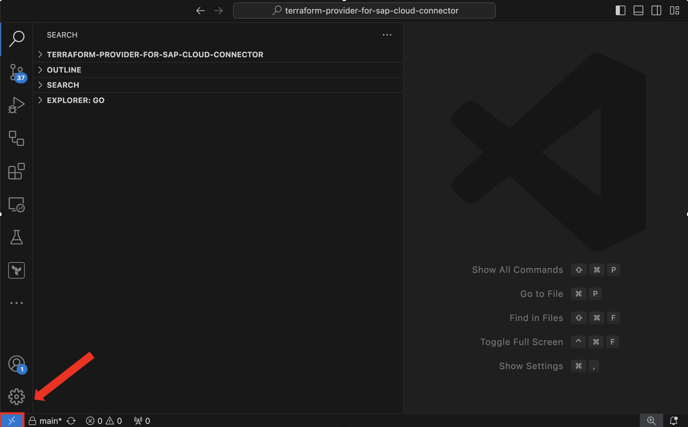

# Development Setup

If you want to contribute to the Terraform provider for SAP Cloud Connector, be aware of the [contribution guidelines](CONTRIBUTING.md) available in this repository.

🚀 Heads-Up!

To get started, you’ll need a running SAP Cloud Connector instance. If you haven’t fired one up yet — no worries! Just cruise over to the [official setup guide](https://help.sap.com/docs/connectivity/sap-btp-connectivity-cf/installation) and follow the steps to get connected.

First, you need to setup your development environment. The following sections describe the options that you have.

## Dev Container

> **Note**: In order to use dev containers, you must have a container runtime up and running on the machine. For details, we refer to the official documentation about [Developing inside a Container](https://code.visualstudio.com/docs/devcontainers/containers).

First, you must clone the repository:

```bash
git clone https://github.com/SAP/terraform-provider-scc.git
```

Then open the cloned repository in [Visual Studio Code](https://code.visualstudio.com/). Within Visual Studio Code, press the "Open a remote Window" button in the lower left corner:



 Visual Studio Code will open the command palette. Choose the option "Reopen in Container":


This will trigger the start of the dev container. You can choose to open a dev container with two configurations:

* "Terraform Provider for SAP Cloud Connector" - the configuration in [.devcontainer/default/devcontainer.json](.devcontainer/default/devcontainer.json) contains the development override for the Terraform provider so that the local build is used. You must set the environment variables `SCC_USERNAME`, `SCC_PASSWORD` and `SCC_INSTANCE_URL` yourself.
* Terraform Provider for SAP Cloud Connector - the configuration in [.devcontainer/withenvfile/devcontainer.json](.devcontainer/withenvfile/devcontainer.json) enhances the "Terraform provider for SAP Cloud Connector" to load environment variables (like username and password) when the container is started. This configuration expects a file called `devcontainer.env` in the folder `.devcontainer`.

> **Note**: `.env` files are excluded from git via `.gitignore`. You can use the file to store the environment variables `SCC_USERNAME`, `SCC_PASSWORD` and `SCC_INSTANCE_URL` that are needed when developing tests.

> **Note**: In the first run, the download of the container might take a while, so maybe time to grab a cup of coffee ☕.

## Local Setup

Ensure you have the following tools installed on your local machine.

* [git](https://git-scm.com/)
* [go](https://go.dev/)
* [golangci-lint](https://github.com/golangci/golangci-lint)
* [make](https://www.gnu.org/software/make/)
* [terraform](https://www.terraform.io/)

### MacOS (Homebrew)

If you run on MacOS, you can use [homebrew](https://brew.sh/) to speed up the installation process:

```bash
brew install git golang golangci-lint make terraform
```

### Windows (Chocolatey)

Windows users can let [chocolatey](https://chocolatey.org/) take over the installation for them:

```bash
choco install git golang golangci-lint make terraform
```

### Configuration of the Terraform CLI

Next you need to setup local development overrides in the Terraform CLI according to [this documentation](https://developer.hashicorp.com/terraform/plugin/debugging#terraform-cli-development-overrides). Once in place, Terraform will only consider local development builds for this provider.

Keep in mind that the [configuration file](https://developer.hashicorp.com/terraform/cli/config/config-file) location depends on your operating system:

* Mac/Linux/WSL: `~/.terraformrc`
* Windows: `%APPDATA%/terraform.rc`

The configuration should look similar to this:

```hcl
provider_installation {
  dev_overrides {
    "sap/scc" = "/path/to/go/bin" # the GOBIN directory can be found in the folder which `go env GOPATH` returns
  }

  direct {}
}
```

### Cloning of the Repository

The last step is then to clone the repository on your machine via:

```bash
git clone https://github.com/SAP/terraform-provider-scc.git
```

Navigate into the directory of the cloned repository.

## Install the Terraform Provider for SAP Cloud Connector Locally

Run the following command to build and install the provider:

```bash
make install
```

## Verify the Setup

Next, we verify that Terraform has access to your local build of the provider. Navigate to the folder `examples/provider/`:

```bash
cd examples/provider/
```

To verify the setup, execute the `terraform validate` command:

```bash
terraform validate
```

If the setup was successful you should see the following message:

```bash
╷
│ Warning: Provider development overrides are in effect
│
│ The following provider development overrides are set in the CLI configuration:
│  - sap/scc in /go/bin
│
│ The behavior may therefore not match any released version of the provider and applying changes may cause the state to become incompatible with published releases.
╵
Success! The configuration is valid, but there were some validation warnings as shown above.
```

In case of errors, please check first that you executed the previous steps correctly. If you are still stuck, feel free to ask for support by raising a [question](https://github.com/SAP/terraform-provider-scc/discussions/categories/q-a) in the [GitHub Discussions](https://github.com/SAP/terraform-provider-scc/discussions) of this repository.

> **Note**: Be aware that when using the development override you must not use the `terraform init`command. It is not necessary and may error unexpectedly.

## Howto Commit

Once you're done applying changes to the cloned repository, please ensure that the tests can still be executed (by running `make test`) and that the documentation is up to date (by executing `make generate`). Afterwards you're encouraged to open a pull-request to this repository. Please be aware that we're following the [conventional commits specification](https://www.conventionalcommits.org/en/v1.0.0/), which means the pull-request title has to be structured in a certain way:

* `fix: typo in the documentation`
* `feat: new resource xyz added`
* `refactor!: aligning schemas`
* `feat(scc_subaccount): a scoped feature`

For more examples, please have a look in the [conventional commits specification](https://www.conventionalcommits.org/en/v1.0.0/).
